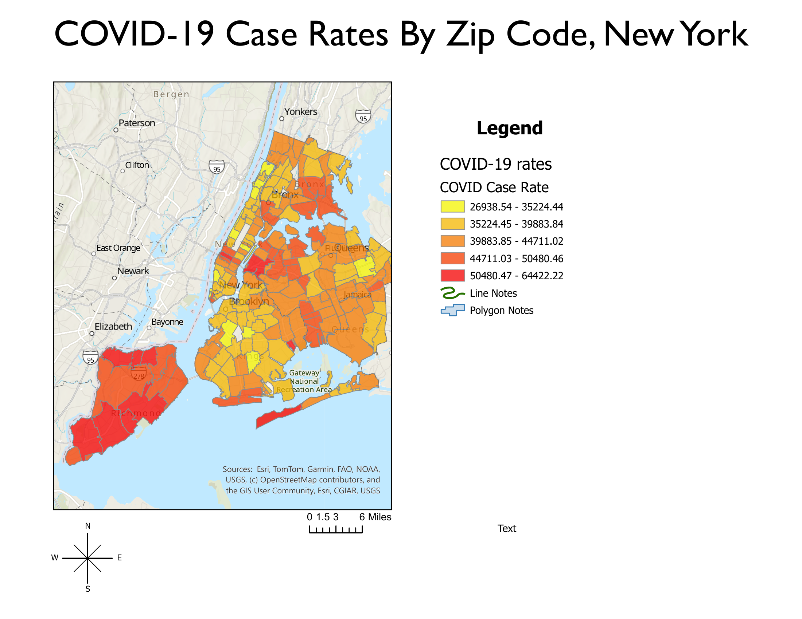
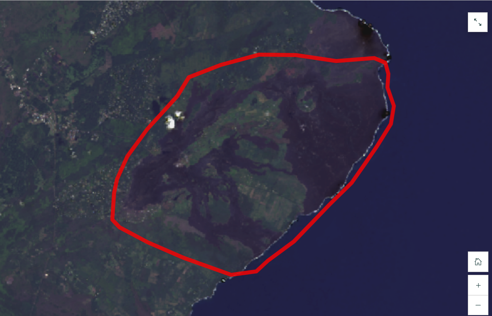

# [Johnny Ramirez]
[Hi my name is Johnny Ramirez I am currently studying Global Business and Environmental Sciences at RCC. What i want to do with GIS is to use it for my Wildlife major when I transfer out as I know these skills using this program are going to be beneficial for my major and my career ]
---
## [COVID-19 Case Rates By Zip Code, New York]

**Question:** [One question this map answers is where most of the COVID-19 case rates are based off of the zip code ]
**Data:** [The dataset name is COVID-19 Case Rates it was published by Ersi in 2024 and I got the data from ArcGIS Online.]
**Method:** [I first gathered the data from ArcGis Online and used it to create a map. Once that map was created I imported it to ArcGIS Pro where I used the tools there to create the map above which included the legend of case rates, the compass, and the map itself showing the COVID-19 Case Rate ]
**A design choice I made and why:** [ One choice I made was that I put the compass at the bottom of the map rather than next to the legend or on the mpa itself as to not block any important data.]
**A limitation of this map:** [One limitation this maps shows is the percentage of people who may have had COVID-19 but not been recorded or been tested for it as people may have been asymptomatic or not have been tested at all] 
## [2018 Kilauea Eruption]
 *Interactive version, live as of [10/2026]: [https://storymaps.arcgis.com/stories/1aa662894fe540df9f7b9a809366b476]*
**Question: One question this map answers is how much the land around the eruption changed overtime**
**Data: The dataset is Kilauea 2018 Lava Flow Extent and it was published by Ersi in 2022 and I got the data from ArcGIS Online**
**Method:For my methods I got all the layers I needed for this map and chaged the colors and saturation to help them show up better on a map. Once that iwas done I compared the layers from before and after the eruption then with that information I put into an interactive version which is in the link above which shows the difference between the eruption cycle**
**A design choice I made and why:A design choice I made and why was I had to change the coloring of certain layers using the brightness tool as some layers would not show up properly if they were not adjusted**
**A limitation of this map: A limitation of this map is that it does not show how much the eruption affected other surrounding areas besides the one area that is displayed on the map**
---
## Data sources
- [Kilauea 2018 Lava Flow Extent, Ersi, 2022, https://services2.arcgis.com/j80Jz20at6Bi0thr/arcgis/rest/services/Kilauea_2018_Lava_Flow_Extents/FeatureServer]
- [COVID-19 Counts, Ersi, 2024, https://services3.arcgis.com/HHsRcAgIU6SqBiQd/arcgis/rest/services/COVID19_ZCTA/FeatureServer]
## Where this is going
[In this portfolio I plan to add more maps that I have created using ArcGIS Pro/Online. I want this portfolio to show my hard work and how much I've grown using as GIS software at the end of this term as I know these skills might be difficult now but they payoff will be big in the long run. I also want this to show how far my skills have came as I came into using GIS software not knowing anything to slowly navigating my way to use it and hopefully I will be comfortable with using it by the end of this term.]
